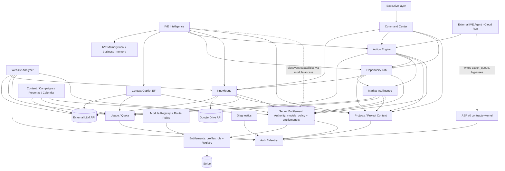

# Module Dependency Map

Mission: `INSIGHTVALUES-MODULE-PORTFOLIO-ARCHITECTURE-01`
Status: AUDIT (derived from tables, Edge Functions, providers and registry
`databaseDependencies`/`edgeFunctions` at Module Lab base `ffd7361`).

## 1. Graph

Conceptual graph (data and call dependencies). Since
MODULE-FOUNDATION-AND-ENTITLEMENT-02 every module Edge Function depends on
the server entitlement authority (`SENT` below; MODULE_ARCHITECTURE.md §13),
which depends only on Auth and the caller's own profile/role rows. The external-agent edge comes from the separate repository
`insightvalues-ive-agent`; its live Cloud Run deployment was not verified.

## 2. Hub dependencies (fan-in)

| Core node | Direct dependents | Note |
|---|---|---|
| Auth | every node | healthy — single identity mechanism |
| Projects | MI, Opportunity, Action, Knowledge, IVE, Command Center | ownership triggers + RLS; `website_analyses`/`copilot_sessions` outside the boundary |
| Quota | every AI EF | healthy — server-side RPC |
| Knowledge | Opportunity, Website, IVE, Strategy, Command Center | provenance only partly recorded |
| IVE Intelligence | reads Projects, Knowledge, Opportunity, Action | **fan-out hub**: IVE depends on almost every module (see §3) |
| External LLM | every AI capability | single-vendor concentration; cost risk |

## 3. Cycles and dangerous couplings

1. **No hard cycles found** in data dependencies (tables reference upward:
   action → opportunity → market_analysis → project).
2. **IVE ↔ modules (soft cycle via UI):** modules embed Ask-IVE CTAs and
   exclusion regions; `ive_context_provider.dart` reads those same
   modules' providers. Today this is Dart-level coupling inside one app,
   acceptable, but it means IVE context cannot be assembled without the
   Flutter client. Blocking for Web-without-Flutter and Extension.
3. **Entitlement ↔ Billing:** Stripe writes `profiles.role`, which is also
   the admin/beta authorization column. (Module Lab: roles move to
   `subject_roles`, migration 20260923000000, not yet applied — after the
   rollout flag is set, billing can no longer rewrite authorization.) A billing defect can therefore
   change authorization state (bounded by the role CHECK and service_role-only
   RPC, but coupled by design).
4. **Two availability authorities:** `feature_flags` table and registry
   `commercialEnabled` both gate Opportunity Lab / Action Engine. The server
   entitlement authority is now the grant; `feature_flags` may only narrow
   (debt D1, not refactored).
5. **Command Center / Executive layer** aggregate client-side across 4+
   modules — any schema change in those modules breaks them silently
   (no shared contract type across modules; the provenance columns
   `origin/sources/rationale/confidence/risks/action_steps` are duplicated
   per table rather than a shared type).
6. **External agent → action_queue** bypasses AEF (MPA-F04).

## 4. Implicit shared contract worth formalizing

`opportunity_lab` and `action_queue` (and `market_analyses` partially) carry
the same provenance tuple: `origin, sources, rationale, confidence, risks,
action_steps`. Formalizing it as one `IntelligenceProvenance` contract
(Dart model + EF type + JSON schema, like `contracts/aef/`) is the smallest
step that turns Website → Market → Opportunity → Action from four silos
sharing columns into a capability pipeline. No migration is needed for the
contract itself.
