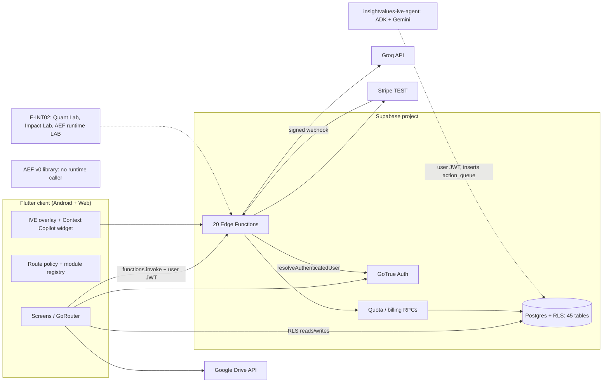

# 02 — Ecosystem Architecture

## 1. Repository and line inventory (discovered 2026-09-28)

| Repository / line | Kind | State | Relationship |
|---|---|---|---|
| `ai-social-copilot` `main` (E-MAIN) | Flutter + Supabase monolith | `CURRENT` canonical | Everything deployable comes from here |
| `ai-social-copilot` `claude/commercial-macro-01` | Commercial line | Unmerged (`e399bcd`) | Absorbed into E-INT02 |
| `ai-social-copilot` `claude/insightvalues-module-architecture` | Module Lab (entitlement core, IVE intelligence core, AEF persistence/runtime) | Unmerged (`5bc767a`) | Absorbed into E-INT02 (base) |
| `ai-social-copilot` `claude/insightvalues-impact-foundation` | Impact Lab | Unmerged (`b52d383`) | Absorbed into E-INT02 |
| `ai-social-copilot` `claude/insightvalues-quant-foundation` | Quant Lab (TypeScript) | Unmerged (`f473597`) | Absorbed into E-INT02 |
| `ai-social-copilot` `claude/insightvalues-integration-macro-02` (E-INT02) | Integration of the four lines above | Unmerged (`d841ebf`) | Candidate next `main` |
| `ai-social-copilot` `release/phase-10-stabilization` | Historical | `LEGACY` | Holds the frozen original `ive-agent-runner` implementation; not a source of truth |
| `ai-social-copilot` 60+ other `claude/*`, `codex/*`, feature branches | Mission branches | Mostly merged or superseded | Not individually documented |
| `insightvalues-quant` (E-QUANT) | Python research framework | 15 branches; `main` empty | Separate; Strategy001 source of truth |
| `insightvalues-ive-agent` (E-AGENT) | Python ADK/Gemini agent (hackathon) | Single `main` | Writes to the same Supabase tables with the user's JWT |
| `insightvalues-site` (E-SITE) | Content/SEO plan for a WordPress site | Single `main` | No code shared with the product |
| Macro-09 Financial RC workspace | Unknown | `ENVIRONMENT_BLOCKED` | Not found in any accessible repo |

Naming conflict: `contracts/aef/README.md` calls the core repository "`InsightValues-Showcase`";
the actual GitHub repository is `jonnipm-web/ai-social-copilot`. → `CONFLICTING_EVIDENCE`
(the Showcase repository proposed in `docs/showcase/SHOW_00_REPOSITORY_BOUNDARY_DECISION.md`
was never created).

## 2. Architecture families

| Family | Current (E-MAIN) | Unmerged (E-INT02 / E-QUANT) | Planned only |
|---|---|---|---|
| CORE COMMERCIAL | Auth, profiles/roles, module registry, route policy, quota, Stripe TEST | Server manifest + `module-access`, `ModulePlan.premium`, lifecycle model | Enterprise tenancy/RBAC/SSO |
| IVE | Context Copilot EF, client context builders, fallback avatar, local memory | `ive-intelligence`, `ive-memory` EFs, session isolation, IVE→AEF intent | Research Intelligence, Living Thesis |
| AEF | Contracts + v0 kernel (mock tools) | Postgres persistence, Human Gate UI card, `aef-runtime` (LAB) | Real tools, external adapters |
| FINANCIAL / QUANT | Registry placeholder `ive-quant` (planned) | Quant Lab EFs; Strategy001 Dart contracts; Python research engine | Robot Builder / Strategy Lab (`ENVIRONMENT_BLOCKED`), broker (never) |
| IMPACT | AEF domain boundary only | Impact Lab (claims, evidence, verification dossier) | Commercial Impact product |
| GROWTH | Improve Post, Personas, Content, Calendar, Campaigns, Performance, ROI (not commercial) | Launched at Pro | Social connectors, scheduling, posting |
| PROJECTS / KNOWLEDGE | Projects, Knowledge Vault, file + Drive import, extraction | Opportunity↔knowledge links | Embeddings / vector retrieval |
| MARKET INTELLIGENCE | Market analysis hub + 6 sub-modules, Website Analyzer | — | Real web research, source attribution |
| OPPORTUNITY INTELLIGENCE | Opportunity Lab | — | — |
| ACTION / EXECUTION | Action Engine (`action_queue` status workflow, no governance) | AEF LAB runtime | Action Engine ↔ AEF reconciliation |
| RESULT / LEARNING | ROI Tracker, Performance (manual), `business_memory` (unread in app) | — | Learning loop |

Recovered/planned families with **no implementation** in any accessible evidence:
RESEARCH INTELLIGENCE, LIVING THESIS, KNOWLEDGE GRAPH (a Dart model `knowledge_graph.dart` exists
as client-side aggregation only), PREDICTIVE INTELLIGENCE, PORTFOLIO / ECOSYSTEM INTELLIGENCE
(the "ecosystem score" is a deterministic client-side computation, not a separate engine).
All are `PLANNED`.

## 3. Ecosystem diagram (E-MAIN, with unmerged lines dashed)

## 4. Structural observations

- **Monolith, not a monorepo.** One Flutter app, one Supabase project, no shared packages
  (confirmed in `docs/showcase/SHOW_00_REPOSITORY_BOUNDARY_DECISION.md` and by tree inspection).
- **Client-heavy orchestration.** Edge Functions (except billing) do not persist; the client
  writes results to Postgres under RLS. See [12](12-edge-functions.md).
- **Two execution paths outside AEF exist**: the Action Engine's direct status writes
  (E-MAIN) and the external ADK agent's `action_queue` inserts (E-AGENT). See [05](05-aef.md) §7.
