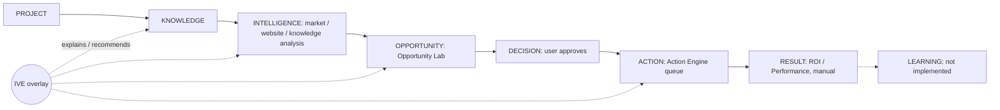

# 03 — Core Commercial Flow

Canonical flow (mission brief): **PROJECT → KNOWLEDGE → IVE → INTELLIGENCE → OPPORTUNITY →
DECISION → ACTION → RESULT → LEARNING**.

The in-repo canonical flow is slightly different: `docs/commercial/COMMERCIAL_PRODUCT_ARCHITECTURE.md`
§1 defines `PROJECT → KNOWLEDGE → ANALYSIS → IVE → OPPORTUNITY → DECISION → ACTION → RESULT`
(no LEARNING stage, IVE after analysis). → `CONFLICTING_EVIDENCE` on ordering; this manual uses
the mission ordering but notes that in code IVE is an **ambient overlay** usable at every
stage, not a pipeline step.

## Stage table (E-MAIN)

| Stage | Responsible components | Inputs | Outputs | Persistence | Security boundary | User interaction | Maturity |
|---|---|---|---|---|---|---|---|
| PROJECT | `lib/features/projects/screens/project_command_center_screen.dart`, `project_provider.dart`, `project_service.dart` | name, type, URL, description | project row, client-computed scores | `projects` (+ `executive_contexts`, `project_events`, `project_resource_allocations`) | RLS `auth.uid() = user_id`; allocations derive ownership through project | CRUD, active project selection | `IMPLEMENTED`, `TESTED` |
| KNOWLEDGE | Knowledge Vault screens, `knowledge_service.dart`, `file_import_service.dart`, `drive_service.dart`; EFs `process-file`, `extract-knowledge`, `generate-strategy` | text, URL, PDF/DOCX/TXT/CSV, Google Drive files | extracted text, AI analysis, strategies | `knowledge_items`, `knowledge_analysis`, `knowledge_strategies` | RLS own rows; `process-file` type/size limits; `extract-knowledge` uses `safeFetch` | upload/import, confirm AI analysis | `IMPLEMENTED`, `TESTED` |
| IVE | `ive_overlay.dart`, `context_copilot_widget.dart`, `context_copilot_provider.dart`, EF `context-copilot` | user question + client-built context (project, scores, opportunities, actions, document excerpts ≤ 8000 chars) | answer + `sources`, `confidence`, `entities`, `action_suggestion` | none server-side (transcript in memory) | auth gate + quota; context treated as untrusted in the prompt | chat overlay on every screen | `IMPLEMENTED`, `TESTED` |
| INTELLIGENCE | Market Intelligence hub + 6 sub-modules, Website Analyzer; EFs `market-analysis`, `competitor-discovery`, `gap-analysis`, `niche-discovery`, `opportunity-discovery`, `content-cluster`, `revenue-planner`, `analyze-website` | niche/project data, URL | LLM-generated analyses (not computed numbers) | `market_analyses`, `competitors`, `gap_analyses`, `niche_rankings`, `opportunities` (legacy), `content_clusters`, `revenue_plans`, `website_analyses` | auth + quota; project ownership WITH CHECK only on `market_analyses` | explicit "Analisar" with confirmation dialog | `IMPLEMENTED`; numbers are LLM inference |
| OPPORTUNITY | Opportunity Lab screens, `opportunity_lab_service.dart`; EF `generate-project-opportunities`; auto-bootstrap | project + knowledge summaries | scored opportunities with sources/rationale/risks | `opportunity_lab` | RLS + project-ownership WITH CHECK (migration `20260919000000`) | review, approve/reject | `IMPLEMENTED` |
| DECISION | User approval in Opportunity Lab / Action Engine; `decision_validation.dart`; Decision Center (beta); EF `decision-simulator` (no UI) | opportunity, scores | status transition `approved` | `opportunity_lab.status`, `action_queue.status` | RLS only; **no Human Gate record, no AEF** | tap approve | `IMPLEMENTED` (status field); formal decision object `NOT_IMPLEMENTED` |
| ACTION | Action Engine screens, `action_queue_provider.dart`; EF `generate-project-actions` | approved opportunity or generated plan | queue items `pending → approved → executing → completed/cancelled` | `action_queue` | RLS; asset ownership triggers; **status is self-declared, nothing executes externally** | manual status changes | `IMPLEMENTED`; execution `NOT_IMPLEMENTED` |
| RESULT | ROI Tracker, Performance (manual metrics) | user-entered numbers | metrics | `roi_metrics`, `performance_metrics` | RLS own rows | manual entry | `IMPLEMENTED` (not commercial on main) |
| LEARNING | — | — | — | `business_memory` table exists; no app reader | — | — | `NOT_IMPLEMENTED` |

## Known defects on the flow (E-DOC, re-verified where noted)

| Defect | Evidence | Status |
|---|---|---|
| Duplicate Action creation from one Opportunity (no unique constraint) | `COMMERCIAL_PRODUCT_ARCHITECTURE.md` §3.2; no `UNIQUE(user_id, opportunity_lab_id)` in any migration on E-MAIN (`VERIFIED` by grep) | Open on E-MAIN |
| "Pausar" reuses `approve()`; no `paused` status | same doc §3.3; `action_queue_item.dart` has no `paused` (`VERIFIED`) | Open on E-MAIN |
| Numbers in market/revenue/decision outputs are LLM-generated, not computed | E-INT02 `docs/quant/QUANT_CURRENT_STATE.md` §5 | Open (recorded as risk R-AI-02) |
