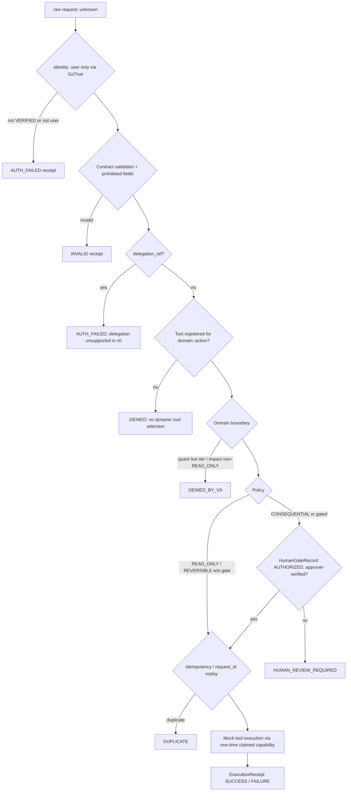

# 05 — AEF (Autonomous Execution Fabric)

Core trust principle (`contracts/aef/README.md`): **IVE MAY REQUEST. IVE MUST NOT AUTHORIZE.**

## 1. What exists where

| Component | E-MAIN | E-INT02 (unmerged) |
|---|---|---|
| Contracts (JSON Schema v1 + reference validator) | `IMPLEMENTED`, `TESTED` — `contracts/aef/` | same |
| v0 kernel (in-memory, fail-closed) | `IMPLEMENTED`, `TESTED` — `aef/kernel.ts` | same, unchanged |
| Persistence (Postgres: gates, idempotency, receipts, audit, retention, erasure, reconciliation) | `NOT_IMPLEMENTED` | `LAB` — migrations `20260925000000_aef_persistence.sql`, `20260926000000_aef_hardening.sql`, `20260927000000_aef_sequence_privileges.sql`; not applied |
| IVE → AEF runtime bridge | `NOT_IMPLEMENTED` | `LAB` — `E-INT02:aef/runtime/`, EF `aef-runtime` (admin-only, hard-blocked from deploy), kill switch `AEF_RUNTIME_MODE=LAB` / `AEF_TOOLS=MOCK_ONLY` / local host |
| Human Gate UI | `NOT_IMPLEMENTED` | `LAB` — `AefActionCard` behind `AEF_RUNTIME_LAB` |
| Real tools | `NOT_IMPLEMENTED` | `NOT_IMPLEMENTED` |
| Runtime callers | **none** (`VERIFIED`: no import of `aef/` or `contracts/aef` from `lib/` or `supabase/functions/`) | LAB only |
| Deployment | not deployable (not a function) | `aef-runtime` excluded from deploy allowlist |

## 2. Contracts (`contracts/aef/schema/*.v1.schema.json`)

| Contract | Required fields (verified) | Purpose |
|---|---|---|
| ExecutionRequest | `contract_version, request_id, requested_at, expires_at, actor, intent, domain, action` (+ optional `resource, parameters, constraints, quant_execution_tier, context_ref, idempotency_key, delegation_ref, human_gate_ref, metadata, correlation_id`) | What a component asks AEF to do. `domain ∈ {core, quant, impact, internal}`; `quant_execution_tier ∈ {research, backtest, paper, controlled_live, expanded_live}` |
| DelegationEnvelope | `issuer, subject, audience, issued_at, expires_at, nonce, purpose, scope, request_binding, auth_assertion_ref, …` | Single-use, audience-scoped delegation |
| HumanGateRecord | `gate_id, request_id, action, state, expires_at` (+ `approver, decided_at, audit_ref`) | The only legitimate source of "a human approved this" |
| PolicySignal | `kind, source, signal, computed_at` | Separates advisory reasoning from authoritative decisions |
| ExecutionReceipt | `receipt_id, request_id, actor, action, policy_decision, started_at, outcome` (+ `human_gate_ref, tool, completed_at, verification_ref, error, rollback_ref, deployment_identity`); `outcome ∈ {SUCCESS, FAILURE, PARTIAL, ROLLED_BACK, NOT_EXECUTED}` | Record of a governed attempt |

`prohibited_fields.ts` rejects authority-shaped fields (`role`, `is_admin`, `admin`, `superuser`, …)
anywhere in a request, at any depth. Fixtures include `invalid/quant-live-without-human-gate.json`
and cross-domain examples for core/quant/impact.

## 3. Kernel pipeline (`aef/kernel.ts`)

| Concern | Mechanism | Evidence |
|---|---|---|
| Policy | Deterministic; never an LLM. `READ_ONLY → ALLOW`; `REVERSIBLE → ALLOW` unless tool requires gate; `CONSEQUENTIAL → REQUIRE_HUMAN_REVIEW` | `aef/policy_evaluator.ts` |
| Identity | `user` only, via `SupabaseUserVerifier` wrapping `resolveAuthenticatedUser()`; claimed id must match verified id; `service`/`system` → unsupported | `aef/identity_resolver.ts`, `aef/adapters/supabase_identity_resolver.ts` |
| Entitlements | Not consulted by v0 kernel | — (E-INT02 adds server entitlement core separately) |
| Risk classification | Property of the registered tool, not inferred from the action string | `aef/action_classification.ts` |
| Hard domain boundary | Quant `controlled_live`/`expanded_live` denied even with an authorized gate; Impact denied unless `READ_ONLY` | same file |
| Human Gate | `InMemoryHumanGateStore` with `#private` storage, `structuredClone` on read/write, approver re-verified | `aef/human_gate_store.ts`, `aef/human_gate_evaluator.ts` |
| Tool Registry | Sealed; frozen copies; `claimExecutionRights()` returns execution capability exactly once (to the kernel) | `aef/tool_registry.ts` |
| Lease/claim | Idempotency claim `IN_FLIGHT`/`COMPLETED`; no lease timeout in v0 | `aef/idempotency_guard.ts` |
| Receipts | Built for every exit; builders are exported (known residual: a caller with module access could forge a receipt) | `aef/receipt_builder.ts`, `aef/README.md` |
| Audit | None in v0 | E-INT02 `AEF_CURRENT_STATE.md` G11 |
| Learning integration | None | — |

Registered tools (all `internal` domain, all **mock**): `internal.mock_read_echo` (READ_ONLY),
`internal.mock_reversible_update` (REVERSIBLE), `internal.mock_consequential_action` (CONSEQUENTIAL, gated),
`internal.mock_failing_tool` (REVERSIBLE, always FAILURE). No LAB tool, no real tool, no external adapter.

## 4. Adversarial review history (E-DOC)

`aef/README.md` records four Codex rounds (approval spoofing, direct execution fallback,
tool spoofing, identity type bypass, mutable-object aliasing) with the final verdict
"0 open P0/P1". Treat as `HISTORICAL_EVIDENCE_ONLY`; the tests that encode those findings
(`aef/kernel_test.ts`, 58 static `Deno.test` declarations) are `TESTED` and run in CI job
`contract-and-aef-ci`.

## 5. Known v0 gaps (from E-INT02 `docs/architecture/modules/AEF_CURRENT_STATE.md`)

G1 in-memory stores · G2 global idempotency namespace · G3 same key/different payload ·
G4 approval not bound to payload · G5 any verified user can approve · G6 caller-seeded gates ·
G7 gate never consumed · G8 retry after side-effect · G9 no timeout/lease/crash recovery ·
G10 forgeable receipts · G11 no audit · G12 no policy version · G13 no payload hash ·
G14 no resource ownership check · G15 IVE→AEF mapping undefined.
E-INT02 reports most closed in its persistence line (`LAB`). On E-MAIN all remain.

## 6. Authority model — verified against code

| Actor | Intended authority | E-MAIN reality |
|---|---|---|
| IVE | analyze, explain, recommend, propose | `VERIFIED`: display-only suggestion |
| Quant / domain engines | deterministic evidence | Not on E-MAIN; E-INT02 Quant analytics read-only; E-QUANT research only |
| AEF | governs consequential execution | Library only; governs nothing at runtime |
| Executor | executes authorized operations | Mock tools only |
| User | final authority over consequential decisions | Holds all authority today, via direct UI status changes |

## 7. Execution paths that bypass AEF (inconsistencies)

| Path | What it does | Governance | Status |
|---|---|---|---|
| Action Engine UI | `approve()/execute()/complete()` direct Supabase status writes | RLS only; no Human Gate record, no receipt | `IMPLEMENTED` on E-MAIN; reconciliation deferred (E-INT02 final report) |
| External ADK agent (E-AGENT) | Gemini agent reasons and inserts `action_queue` rows (and `business_memory`) "autonomously, without human intervention" (its README) | User JWT + RLS; no Human Gate, no receipt | `IMPLEMENTED` in E-AGENT; runtime `UNKNOWN` |
| `ive-agent-runner` historical implementation | Read-only tools + 1 propose tool | Retired; stub returns 410 | `DEPRECATED` |

Neither path can reach money, brokers, email or social posting — the writes are internal
status/queue rows. Broker/external execution: `NOT_IMPLEMENTED` anywhere.
