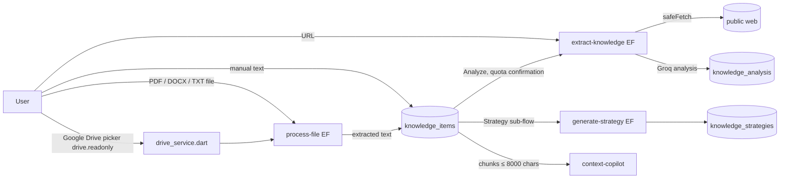

# 06 — Projects + Knowledge Vault

Projects and Knowledge are the operational center of the product: almost every other module
reads a project and its knowledge items (`docs/commercial/PROJECT_CONTEXT_CONTRACT.md`).

## 1. Projects

| Aspect | E-MAIN evidence | Status |
|---|---|---|
| Table | `projects(id, user_id NOT NULL → auth.users, name, description, type, url, opportunity_score, revenue_potential, complexity_score, priority_score, time_to_revenue_days, status, market_analysis_id, details_json, …)` | `IMPLEMENTED` |
| Ownership | Single user (`user_id`). No organization/workspace/team concept anywhere. | `VERIFIED` |
| RLS | `"Users manage own projects" FOR ALL USING (auth.uid() = user_id)` | `VERIFIED` |
| Child tables bound to a project | `executive_contexts` (insert checks project ownership), `project_events`, `project_resource_allocations` (ownership derived **through** the project in both USING and WITH CHECK), `assets` (trigger-validated) | `VERIFIED` |
| Tables with a nullable `project_id` and **project-ownership WITH CHECK** | `market_analyses`, `opportunity_lab` (migration `20260919000000_project_ownership_boundary_closure.sql`) | `VERIFIED` |
| Tables with a nullable `project_id` and **no** project-ownership check | `knowledge_items`, `content_items`, `knowledge_analysis`, `business_memory`, `action_queue`, `revenue_plans`, `roi_metrics` | `VERIFIED` → residual risk R-DATA-01 |
| Active project on the client | `project_provider.dart`; project-scoped IVE context (`test/providers/ive_project_context_test.dart`, `project_briefing_scoping_test.dart`) | `IMPLEMENTED`, `TESTED` |
| Command Center | `project_command_center_screen.dart` — list + detail sheet, "Ask IVE", auto-bootstrap trigger (with quota confirmation) | `IMPLEMENTED` |
| Scoring | Client-side deterministic services (`project_intelligence_service.dart`, `ecosystem_intelligence_service.dart`) | `IMPLEMENTED` |

Cross-project boundary: a user can only **read** their own rows everywhere (RLS). The residual
gap is **write-side association**: on the seven tables above, a user can insert their own row
pointing at another user's `project_id` (if they know the UUID). The victim cannot see that row
(RLS filters by `user_id`), so the impact is integrity/confusion, not disclosure.

## 2. Knowledge Vault

| Aspect | E-MAIN evidence | Status |
|---|---|---|
| Ingestion: file | `process-file`: allowlist `txt/pdf/docx`, base64 ≤ 8 MB checked before decode, DOCX XML ≤ 5 MB (zip-bomb guard), regex PDF text extraction (no pdf-parse), auth gate. No AI call, no quota. | `IMPLEMENTED`, `TESTED` (10 static tests) |
| Ingestion: Google Drive | `drive_service.dart`, `drive_stage.dart`; OAuth scope `https://www.googleapis.com/auth/drive.readonly` (broader than needed — registry note "OVERBROAD / POST-MVP HARDENING"); login scopes are separate (identity only) | `IMPLEMENTED`, `TESTED` (12 static tests) |
| Ingestion: URL | `extract-knowledge` → `_shared/safe_fetch.ts` (SSRF guard) | `IMPLEMENTED`, `TESTED` |
| Knowledge persistence | `knowledge_items(content, source_type, source_url, file_name, file_type, file_storage_path, status, persona_id, project_id, auto_* fields)` | `IMPLEMENTED` |
| Supabase Storage | Column `file_storage_path` exists; no bucket is created by any migration on E-MAIN | `UNKNOWN` (live bucket state not inspected) |
| Analysis | `knowledge_analysis` (per-channel scores incl. LinkedIn, keywords/topics) via `extract-knowledge` | `IMPLEMENTED` |
| Prompt-injection delimiter for document content in `extract-knowledge` | Present only on commercial line commit `a1fa942` (not an ancestor of `main`, `VERIFIED`) | E-MAIN: `NOT_IMPLEMENTED` → R-AI-01 |
| IVE consumption | Client `DocumentContextBuilder` (chunk 800 / overlap 100, word-overlap scoring, 8000-char budget) | `IMPLEMENTED`, `TESTED` |
| Domain-module consumption | Opportunity generation and auto-bootstrap send first 6 items × 400 chars; Market Intelligence reads project knowledge | `IMPLEMENTED` |
| Semantic retrieval / embeddings | None | `NOT_IMPLEMENTED` |
| Opportunity ↔ knowledge links | Migration `20260920000001_opportunity_knowledge_links.sql` exists only on commercial/E-INT02 | E-MAIN: `NOT_IMPLEMENTED` |
