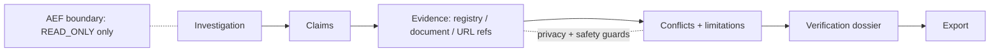

# 08 — Impact Intelligence

Impact is a distinct product/domain experience (social-impact organizations, claims,
evidence, verification). It must stay distinct from generic IVE context even where shared
evidence infrastructure exists.

## 1. Status by baseline

| Baseline | What exists | Status |
|---|---|---|
| E-MAIN | AEF domain `impact` + hard boundary (only `READ_ONLY` Impact actions allowed; Finding F-09: no Impact risk taxonomy); fixture `contracts/aef/fixtures/examples/impact-example.json` | `IMPLEMENTED` (boundary only); product `NOT_IMPLEMENTED` |
| E-INT02 | Full Impact Lab | `EXPERIMENTAL` (admin-only), unmerged, not applied, not deployed |

Hits for "impact" elsewhere on E-MAIN are marketing impact/effort scores — unrelated.

## 2. Impact Lab architecture (E-INT02, `HISTORICAL_EVIDENCE_ONLY` unless noted)

| Concern | Evidence (all paths on E-INT02) |
|---|---|
| Domain model: investigation, organization, claim, evidence, conflict, limitation, verification | `E-INT02:docs/impact/IMPACT_DOMAIN_MODEL.md`, `IMPACT_EVIDENCE_MODEL.md`, `IMPACT_VERIFICATION_MODEL.md` |
| Epistemic classes (FACT / CLAIM / EVIDENCE / ALLEGATION / …) kept structured, never collapsed into IVE context | final report of E-INT02 |
| Provenance / source lineage | `IMPACT_SOURCE_MODEL.md`, `IMPACT_SOURCE_LINEAGE.md` |
| Integrity: privacy redaction, prompt-injection and verdict-language safety guards, reputational safety | `IMPACT_PRIVACY_MODEL.md`, `IMPACT_REPUTATIONAL_SAFETY.md`, `IMPACT_SECURITY_MODEL.md` |
| Registry providers (Companies House, Charity Commission, IRS EO BMF) | `_shared/impact_registry/` — adapters written, **not composed live** |
| Verification dossier + export | `IMPACT_VERIFICATION_DOSSIER.md`, `IMPACT_DOSSIER_SCHEMA.md`, `IMPACT_DOSSIER_EXPORT.md` |
| Persistence + RLS (owner_id = auth.uid() + project ownership) | migrations `20260924010000_impact_lab_persistence.sql`, `20260925010000_impact_registry_intelligence.sql`, `20260926010000_impact_evidence_collection.sql`, `20260927010000_impact_verification_dossier.sql`, `20260928010000_impact_product_rate_limit.sql` — **not applied to production** |
| API | EF `impact-lab` (admin-only, not deployed) |
| UI | `/impact`, `/impact/:id` (admin-only via lifecycle) |
| Physical device evidence | commit message `b52d383` "I6 physical closure — S25 findings" (Samsung S25, per Quant/Impact docs) |

## 3. Rules for future work

- Do not route Impact actions through AEF as anything but `READ_ONLY` until an Impact
  consequential-action taxonomy exists (F-09).
- Do not merge Impact evidence into generic IVE context without the Impact privacy/safety layer.
- Reputational/defamation risk is the primary domain risk (E-INT02 `MODULE_PORTFOLIO.md` §5).
