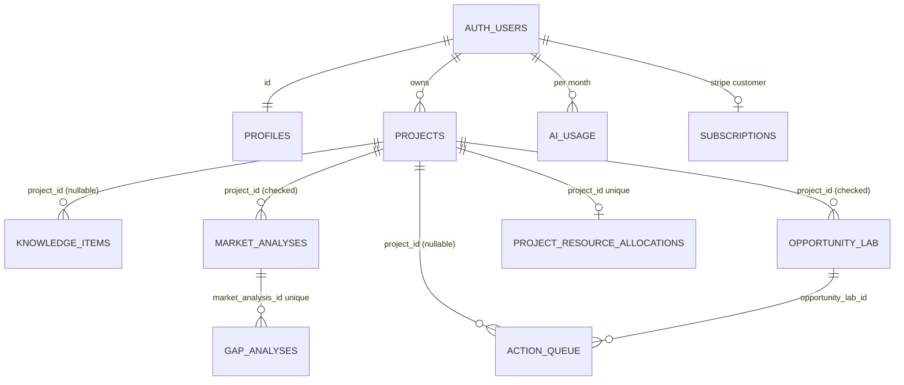

# 10 — Data Architecture

Baseline: E-MAIN, `supabase/migrations/` (15 files). **45 tables** in `public`, **RLS enabled on
all 45** (`VERIFIED`: 45 `ENABLE ROW LEVEL SECURITY` statements). `relforcerowsecurity = false`
everywhere (baseline comment). No production data was read by this mission.

Tenancy model: **single user** (`user_id` / `owner_id` = `auth.users.id`). There is no
organization/workspace/team table. Read authority = the owning user (plus admin where a policy
says `is_admin_user()`); write authority = the owning user via PostgREST under RLS, except where
noted as "RPC-only" or "service_role-only".

## 1. Entities by domain

### Identity, roles, platform config

| Table | Ownership | RLS summary | Write authority | Notes |
|---|---|---|---|---|
| `profiles` | `id` = user | `users_own_profile` (ALL own) + `admin_all_profiles` (ALL if `get_current_user_role()='admin'`) | Own row; `role`, `monthly_limit`, `is_active` protected by trigger `trg_prevent_self_privilege_escalation` (BEFORE INSERT OR UPDATE) | `role ∈ {free, pro, premium, beta_tester, admin}`, default `free`, `monthly_limit` default 5; created by `handle_new_user()` on `auth.users` insert |
| `feature_flags` | global | `feature_flags_read` (SELECT) only; no write policy | service_role / SQL only | 6 seed rows (`supabase/seed.sql`), all `enabled=true, plan_required='free'` |

### Projects and portfolio

| Table | Ownership | Project binding | RLS / integrity |
|---|---|---|---|
| `projects` | `user_id` | — | ALL own |
| `executive_contexts` | `user_id` | `project_id NOT NULL` | select/update own; insert checks project ownership |
| `project_events` | `user_id` | `project_id NOT NULL` | select/delete own; insert checks project ownership; no UPDATE policy |
| `project_resource_allocations` | via project | `project_id NOT NULL UNIQUE` | USING + WITH CHECK through `projects.user_id`; money as `bigint` cents, currency ∈ {BRL, USD, EUR} |
| `assets`, `asset_resources` | `user_id` | `assets.project_id NOT NULL` | per-command own policies; SECURITY DEFINER ownership triggers |

### Knowledge

| Table | Ownership | Project binding | RLS |
|---|---|---|---|
| `knowledge_items` | `user_id` | nullable, **no ownership check** | select/update/delete own or admin; insert own |
| `knowledge_analysis` | `user_id` | nullable, **no ownership check** | same pattern |
| `knowledge_strategies` | `user_id` | — | same pattern |

### Market & opportunity intelligence

| Table | Ownership | Project binding | RLS |
|---|---|---|---|
| `market_analyses` | `user_id` | nullable, **ownership WITH CHECK** (`20260919000000`) | ALL own |
| `competitors`, `gap_analyses`, `niche_rankings`, `content_clusters`, `revenue_plans`, `opportunities` (legacy) | `user_id` | `revenue_plans.project_id` nullable, no check; others via `market_analysis_id` | ALL own |
| `gap_analyses_archive`, `content_clusters_archive`, `revenue_plans_archive` | `user_id` | — | SELECT own only; written by migration `20260916000000` (superseded duplicates preserved, not deleted) |
| `website_analyses` | `user_id` | **no `project_id` column** | ALL own |
| `trend_signals` | `user_id` | — | ALL own |
| `opportunity_lab` | `user_id` | nullable, **ownership WITH CHECK** | ALL own |

### Action, result, memory

| Table | Ownership | Project binding | RLS |
|---|---|---|---|
| `action_queue` | `user_id` | nullable, no ownership check (asset trigger validates asset↔project) | ALL own; writers: app + external agent (E-AGENT) |
| `roi_metrics`, `performance_metrics` | `user_id` | `roi_metrics.project_id` nullable, no check | ALL own |
| `business_memory` | `user_id` | nullable, no ownership check | ALL own; no app reader (E-INT02 IVE doc) |
| `advisor_profiles` | `user_id` | — | ALL own |

### Content / Growth

| Table | Ownership | RLS |
|---|---|---|
| `personas` | `owner_id` (+ `is_global`) | read own or global; write own; admin ALL |
| `persona_training`, `post_generations`, `campaigns`, `campaign_calendar`, `content_items`, `calendar_items` | `user_id` | own (+ admin on some); `content_items.project_id` nullable, no check; `post_generations` has no UPDATE policy; `campaign_calendar` has no UPDATE policy |

### IVE / copilot

| Table | Status |
|---|---|
| `copilot_sessions`, `copilot_messages`, `copilot_context` | Schema + own RLS; **no reader or writer** in `lib/` or functions (E-INT02 finding IVE-F08) → dead tables |

### Billing and quota

| Table | Ownership | RLS | Write authority |
|---|---|---|---|
| `ai_usage` | `user_id` | SELECT own | RPC-only (`try_reserve_ai_quota`, `refund_ai_quota`, SECURITY DEFINER) |
| `ai_quota_reservations` | `user_id` | SELECT own | RPC-only; partial unique index on active `(user_id, idempotency_key, operation_type, period_start)` |
| `subscriptions` | `user_id` | SELECT own | service_role only (`create-checkout-session` upsert, `stripe-webhook` via `apply_stripe_subscription_state`) |
| `processed_webhook_events` | internal | no policies | service_role only |

### Diagnostics

| Table | RLS | Notes |
|---|---|---|
| `diagnostic_sessions` | admin manages own; admin reads all | one active session per admin (`20260915000000`) |
| `diagnostic_events` | insert only into own active session; admin reads all | `build_sha` column (`20260920000000`); client sanitizer redacts content |

## 2. Relationships (simplified)

## 3. Provenance and lifecycle

| Concern | State |
|---|---|
| Provenance fields | `opportunity_lab` / `action_queue`: `origin`, `sources[]` (free text), `rationale`, `confidence`, `risks[]`; `market_analyses` versioned with `source_ids` (per E-INT02 portfolio doc); no claim-level lineage |
| Timestamps | `created_at`/`updated_at` on most tables; some `updated_at` triggers declared in legacy files are not live (baseline comment on `profiles`) |
| Deletion | Hard delete + `ON DELETE CASCADE` from `auth.users`; no soft delete, no deletion audit |
| Retention | None defined on E-MAIN (AEF retention policy exists only on E-INT02) |
| Duplicated concepts | `opportunities` (legacy) vs `opportunity_lab`; `projects` vs `assets`; `feature_flags` vs registry `commercialEnabled`; device IVE memory vs `business_memory` (E-INT02 `MODULE_PORTFOLIO.md` D1–D5) |

Unmerged schema (E-INT02, not applied): `subject_roles`/entitlements, `ive_memory` governance,
`quant_watchlists`, quant rate limits, Impact Lab (8+ tables), AEF persistence, opportunity↔knowledge links.
