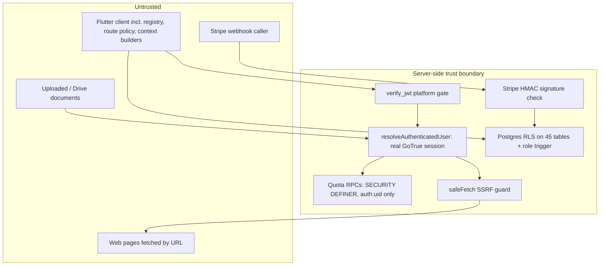

# 14 — Security Architecture

Baseline E-MAIN unless stated. Residual risks are cross-referenced to [27 — Risk Register](27-risk-register.md).

## 1. Boundaries

## 2. Controls

| Control | Implementation | Status |
|---|---|---|
| Authentication | GoTrue sessions; every AI/billing function calls `resolveAuthenticatedUser()` which rejects the anon key and non-session JWTs | `VERIFIED`, `TESTED` |
| Authorization (data) | RLS on all tables; own-row policies; admin via `is_admin_user()` / `get_current_user_role()` | `VERIFIED` |
| Tenant / project isolation | Per-user tenancy; project-ownership WITH CHECK on `market_analyses`, `opportunity_lab`, `executive_contexts`/`project_events` (insert), `project_resource_allocations` | `VERIFIED`; gap on 7 tables (R-DATA-01) |
| Role model | `profiles.role` ∈ {free, pro, premium, beta_tester, admin}; admin panel writes roles under `admin_all_profiles` | `IMPLEMENTED` |
| Anti-self-promotion | `trg_prevent_self_privilege_escalation` BEFORE INSERT OR UPDATE, SECURITY INVOKER; service_role and admin exempt | `VERIFIED`, `TESTED` (x4b/x4r SQL suites, historical) |
| Account deactivation | `profiles.is_active` can be toggled by admin but is **not enforced** by RLS, quota RPC, or client redirect | `VERIFIED` gap (R-SEC-05) |
| Plan entitlements | Client route policy only; server enforces quota count, not module access | Gap on E-MAIN (R-SEC-03); closed on E-INT02 (unmerged) |
| Admin boundaries | Admin routes gated client-side; admin data access enforced by RLS policies; Intelligence Debug gained an admin gate in Release Control Plane mission | `IMPLEMENTED` |
| JWT policy governance | `supabase/config.toml` ↔ `.github/deploy-allowlist.tsv` cross-checked by `scripts/ci/check_deploy_governance.sh`; only `stripe-webhook` may deploy with `--no-verify-jwt` | `VERIFIED` |
| SSRF | `_shared/safe_fetch.ts` for all server-side user URLs (`analyze-website`, `extract-knowledge`); residual DNS-rebinding window | `VERIFIED`, `TESTED` (31) |
| File ingestion | `process-file` type allowlist, pre-decode size cap, DOCX zip-bomb cap | `VERIFIED`, `TESTED` |
| Idempotency | Quota reservations (UUID key + server operation literal + period, partial unique index); Stripe `processed_webhook_events` + event-time ordering | `VERIFIED`, `TESTED` |
| Quota enforcement | Atomic conditional UPDATE under row lock; reserve after validation, refund on provider failure, replays never refund | `VERIFIED`, `TESTED` |
| Human Gate / AEF / receipts | Library only; no runtime path uses them | `IMPLEMENTED`, not active |
| Provenance | Free-text `sources[]`; identity fields on IVE requests for correlation only | Partial |
| Untrusted content / prompt injection | `context-copilot`: all context declared untrusted, grounding contract, size caps. `extract-knowledge`: no delimiter on E-MAIN (added only on commercial line `a1fa942`) | Partial (R-AI-01) |
| Secrets | Server keys only in Edge Function env; client holds only URL + publishable anon key + Google client id | `VERIFIED` |
| Logging / privacy | Diagnostic sanitizer: allowlisted metadata keys + denylist of secret-shaped fragments (`password`, `token`, `secret`, `authorization`, `cookie`, `api_key`, `service_role`, card data); quota audit logs ids/enums only; diagnostics admin-only | `VERIFIED`, `TESTED` (41) |
| Source maps | Built, moved out of the public Pages output, AES-256 encrypted before upload as a 90-day artifact | `VERIFIED` (workflow) |
| CI script injection | Workflow inputs passed via `env:` (IV-DEPLOY-PIPELINE-SECURITY-01) in deploy and avatar-lab workflows | `VERIFIED` |
| Fail-closed behaviour | Auth helper throws; quota errors → 500 without AI call; profile fetch failure → deny route; AEF kernel denies on any dependency failure | `VERIFIED` |

## 3. IVE-specific security

- IVE cannot write, execute or call tools on E-MAIN (`VERIFIED`).
- Server does not verify that the project in `context` belongs to the caller; model only sees
  what the client already read under RLS (IVE-F02, P2).
- Shared-device leakage: transcript provider survives sign-out (IVE-F01, P1) — R-SEC-01.

## 4. Residual risks (summary)

| ID | Risk | Severity rationale |
|---|---|---|
| R-SEC-01 | Previous user's IVE transcript/local memory reused after logout on the same device | Privacy exposure between people sharing a device; documented P1 on E-INT02, still present on E-MAIN |
| R-SEC-02 | External ADK agent writes `action_queue` outside AEF | Autonomous writes without Human Gate/receipt; bounded to internal queue rows |
| R-SEC-03 | Module entitlements client-only on E-MAIN | Direct API use bypasses plan gating (quota still applies) |
| R-SEC-04 | Out-of-band deploys (Dashboard/CLI/MCP) bypass governance, no drift detection | Integrity of what runs in production |
| R-SEC-05 | `is_active=false` not enforced | Deactivated users keep access and quota |
| R-SEC-06 | Stripe webhook overwrites any role (admin/premium/beta) with `pro`/`free` | Privilege loss / downgrade, not escalation |
| R-DATA-01 | Cross-project `project_id` association on 7 tables | Integrity only; no disclosure |
| R-AI-01 | Document content reaches the `extract-knowledge` prompt without an injection delimiter | Output manipulation of that user's own analysis |

No **active critical** security issue (unauthenticated access, privilege escalation, cross-user data
disclosure, secret exposure in code) was discovered by this mission.
