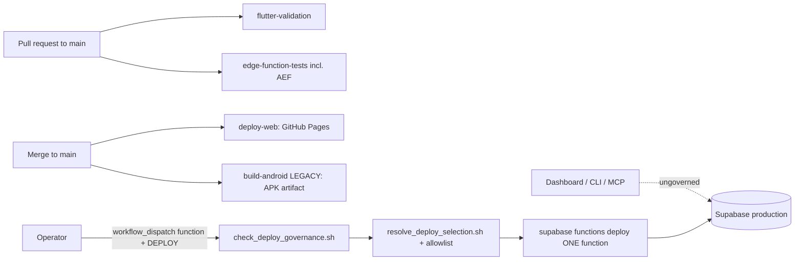

# 18 — CI/CD Architecture

Baseline E-MAIN `.github/workflows/` (12 workflows). No workflow was modified by this mission.

## 1. Workflow inventory

| Workflow | Trigger | What it does | Secrets referenced (names) | Production effect |
|---|---|---|---|---|
| `flutter-validation.yml` | PR → main, manual | analyze (fatal warnings), `flutter test`, `flutter build web` (gate only) | none (placeholder `.env`) | none |
| `edge-function-tests.yml` | PR → main touching functions/aef/contracts, manual | Deno: context-copilot + quota tests; AEF check/lint/tests | none (`GROQ_API_KEY` placeholder) | none |
| `test-context-copilot.yml` | manual | context-copilot Deno tests (deploy capability removed) | none | none |
| `deploy-selftest.yml` | push touching deploy-governance files, manual | Proves allowlist resolution; refuses if production-shaped secrets are present | none | none |
| `x4r-authorization-matrix.yml` | push to `claude/ive-x4-security-boundary-closure` (paths), manual | Local `supabase start`, baseline-only fingerprint, apply 022, seed check, SQL authorization suites | none | none (refuses production ref) |
| `deploy-edge-functions.yml` | **manual only**, inputs `function` + `confirm=DEPLOY` | governance gate → resolve against allowlist → `supabase functions deploy <one>` | `SUPABASE_ACCESS_TOKEN` | **Deploys one Edge Function to production** |
| `deploy-web.yml` | **push to main**, manual | `flutter create` web → SPA hash-restore inject + verify → build (`--base-href /ai-social-copilot/`, `BUILD_SHA`) → source-map verify → encrypt map → publish `build/web` to GitHub Pages | `SUPABASE_URL`, `SUPABASE_ANON_KEY`, `GOOGLE_CLIENT_ID`, `SOURCEMAP_ENCRYPTION_KEY`, `GITHUB_TOKEN` | **Publishes production Web on every merge** |
| `build-android.yml` ("LEGACY — GERAR APK") | **push to main**, manual | `flutter create` android → keystore signing → release APK artifact (30 days) | `SUPABASE_URL`, `SUPABASE_ANON_KEY`, `KEYSTORE_*` | Artifact only (not a store release) |
| `build-apk.yml` | manual | Signed release APK artifact | `SUPABASE_URL`, `SUPABASE_ANON_KEY`, `KEYSTORE_*` | Artifact only |
| `build-debug-device-test.yml` | manual | Debug APK from pinned branch `claude/ive-avatar-v2-build-recovery` | none — writes a hardcoded Supabase URL + publishable key into `.env` | Artifact only |
| `build-ive-avatar-lab.yml` | manual (`source_ref`) | Isolated lab APK (`com.insightvalues.iveavatarlab`), debug keystore, refuses production package ids | none | Artifact only |
| `generate-keystore.yml` | manual ("rodar apenas 1 vez") | Generates a signing keystore | see file | none |

## 2. Gates and governance

- **Merge ≠ deploy** for Edge Functions and migrations. **Merge = deploy** for Web (GitHub Pages).
- `scripts/ci/check_deploy_governance.sh`: no second deploy route, no `--no-verify-jwt` except
  `stripe-webhook`, `ive-agent-runner` undeployable, no wildcard/bulk loop, allowlist ↔ `config.toml` consistency.
- `scripts/ci/resolve_deploy_selection.sh`: strict name format, allowlist membership, hard block
  for `ive-agent-runner`, CRLF-safe.
- Branch protection / required checks: `UNKNOWN` (GitHub settings not read).

## 3. Observations

| Observation | Evidence | Risk |
|---|---|---|
| Most Deno test files are not executed by CI | `edge-function-tests.yml` runs 2 of 15 function test files | R-TEST-01 |
| Legacy APK workflow runs on every push to main and hardcodes an OAuth web client id in `strings.xml` generation | `build-android.yml` | R-CI-02 (hygiene) |
| Debug device workflow hardcodes Supabase URL + publishable key | `build-debug-device-test.yml` | R-CI-02 (publishable keys are public by design) |
| Web and Android scaffolds are regenerated by `flutter create` at build time (not versioned on E-MAIN except `web/404.html`) | `deploy-web.yml`, `build-*.yml` | R-MOB-01 |
| No migration pipeline | no `db push` anywhere | R-MIG-01 |
| E-INT02 adds `entitlement-core-ci`, `quant-foundation-ci` jobs and a disposable-DB RLS job | `git show d841ebf:.github/workflows/edge-function-tests.yml` | unmerged |
