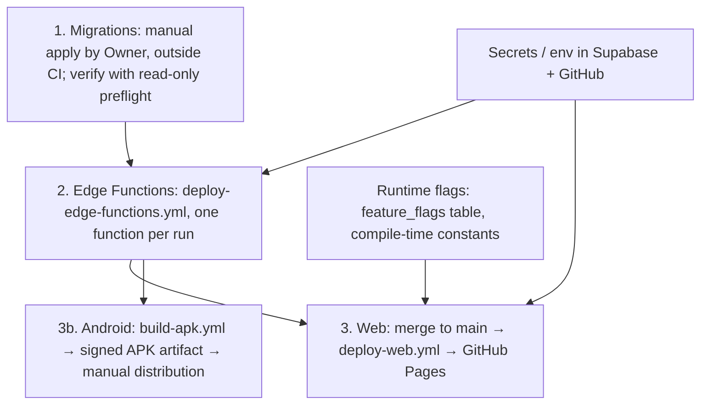

# 19 — Environments and Deployment

## 1. Known environments

| Environment | Evidence | Status |
|---|---|---|
| Local developer | `.env.example` (names: `SUPABASE_URL`, `SUPABASE_ANON_KEY`, `GOOGLE_CLIENT_ID`), `flutter run`, `supabase start` | `IMPLEMENTED` |
| LAB (local-only runtimes) | AEF runtime kill switch (`AEF_RUNTIME_MODE=LAB`, `AEF_TOOLS=MOCK_ONLY`, local host), Quant/Impact dev servers `tool/quant_lab_dev_server.ts`, `tool/impact_lab_dev_server.ts` — **E-INT02 only** | `LAB` |
| CI | GitHub Actions ephemeral runners; `x4r-authorization-matrix.yml` spins a local Supabase stack | `IMPLEMENTED` |
| Development / staging Supabase project | none found | `NOT_IMPLEMENTED` (do not assume staging exists) |
| Production | One Supabase project (ref hardcoded in CI scripts); Web on GitHub Pages under `/ai-social-copilot/`; Android APKs as CI artifacts | `DEPLOYED` (Web: per workflow on every push to main); Supabase state `UNKNOWN` |
| Physical-device validation | Reports cite Android devices (e.g. Samsung S25) and "Physical E2E Gate 05" | `HISTORICAL_EVIDENCE_ONLY` |
| iOS | No `ios/` directory; no iOS workflow | `NOT_IMPLEMENTED` |
| External agent runtime | E-AGENT: Dockerfile + `docs/H1B_CLOUD_RUN.md` (Cloud Run) | `HISTORICAL_EVIDENCE_ONLY`; current state `UNKNOWN` |
| Marketing site | E-SITE: WordPress on hosted server, content applied manually | Outside product architecture |

Known environmental blockers: no local PostgreSQL 17 in recent agent sessions (E-INT02 RLS suite
not run); no Supabase production read in this mission; Macro-09 workspace not accessible.

## 2. Deployment dependency flow (intended, per evidence)

Ordering rule (from E-INT02 `docs/architecture/modules/AEF_PRODUCTION_DEPLOYMENT_PRECONDITIONS.md`
and the 14S migration header): schema first, then functions that depend on it, then clients.
Some migrations have **read-only prerequisite queries** that must return zero rows before apply
(e.g. `20260919000000_project_ownership_boundary_closure.sql` header).

## 3. Per-artifact deployment

| Artifact | Path | Governance | Rollback |
|---|---|---|---|
| Database migrations | Manual (SQL editor / CLI / MCP) | None in CI; files document rollback SQL in headers (e.g. quota, billing) | Manual reverse SQL; no automated down-migrations |
| Edge Functions | `deploy-edge-functions.yml` | Allowlist, JWT policy, governance gate, single function | Redeploy previous source; `ive-agent-runner` only via explicit mission (never version 5) |
| Web | `deploy-web.yml` on push to main | Build + SPA + source-map gates | Revert commit on main (redeploys) or re-run on older SHA |
| Android | `build-apk.yml` / `build-android.yml` artifacts | Keystore secrets; no store upload | Distribute previous artifact (30-day retention) |
| Play Console | none in repo | — | `UNKNOWN` |
| Configuration | Supabase secrets, GitHub secrets | Manual | Manual |
| Runtime flags | `feature_flags` rows, `IveRiveFeatureGate`, AEF env kill switch (E-INT02) | Manual / code review | Flip back / revert |

## 4. What this manual does not claim

It does not claim any specific migration or function version is live. Use
[24 — Verification Matrix](24-verification-matrix.md) and add a dated read-only production check
before asserting `DEPLOYED`.
